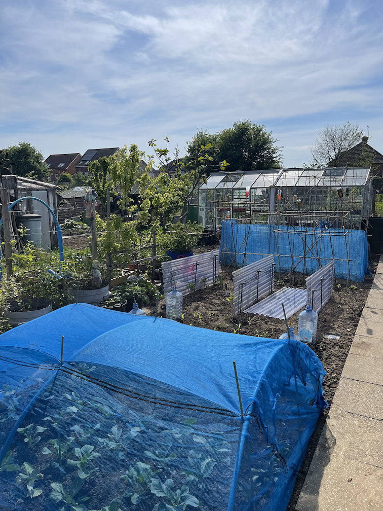

It was a busy (and warm!) day at the allotment,
today we needed to do a lot of planting out and protecting crops from birds and slugs,
but the allotment is taking shape.
It's great to see plants starting to fruit, areas clearly defined and the greenhouses clear down!

## Brassicas
Our brassicas are now covered with a fine netting that hopefully will stop the cabbage white butterflies from having a feast.

  

## Beans

### Supports