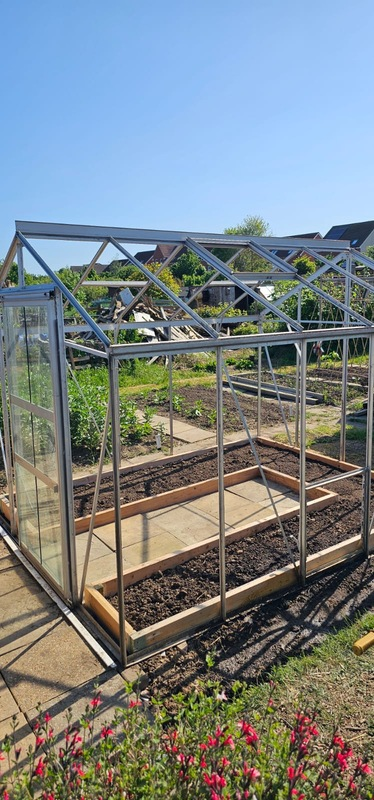

## New greenhouse

It seems like at the allotment we are always building something, and this week was no different.
We acquired a new greenhouse (10' x 8') for Plot 2
(still to be named!) and we've decided to do something different with this one, we're planting into the ground.
Until now, our other greenhouses have been used for seedlings and plants in pots,
but this one we wanted to grow directly in the ground.
The idea is that we will have on one side two rows of crops
(tall at the back, short at the front) and then the other side will be one row of something else.

We're particularly proud of this build so far,
visually it just seems to be a lot better than the other greenhouses but I can't really put my finger on why.
The next task is to get all the glass in (which is a lot of glass!) and then we can start planting in it.

  

## Greenery everywhere

I like most months/seasons at the allotment for different reasons,
in winter its often muddy and dormant but it offers time to build and prep for the year ahead.
As we come into summer there is so much greenery everywhere,
the plants really start to take hold (and we have a load of headaches caused by planting on...)

  

  

## The good and the bad

I want to be honest about the allotment, and that means showing the good and the bad.
This year we've really got some things right, so much so that we are wondering where to put things!
But other things just don't work out, the Sweetcorn went in last week and it was a bit of a disaster.
Not really sure why it hasn't taken,
maybe it was too cold at night for them still,
maybe we should have hardened them off, either way, we'll replant and go from there.

 

## Frames

Another one of our recent projects - building the frames for the climbing/runner beans. 

  